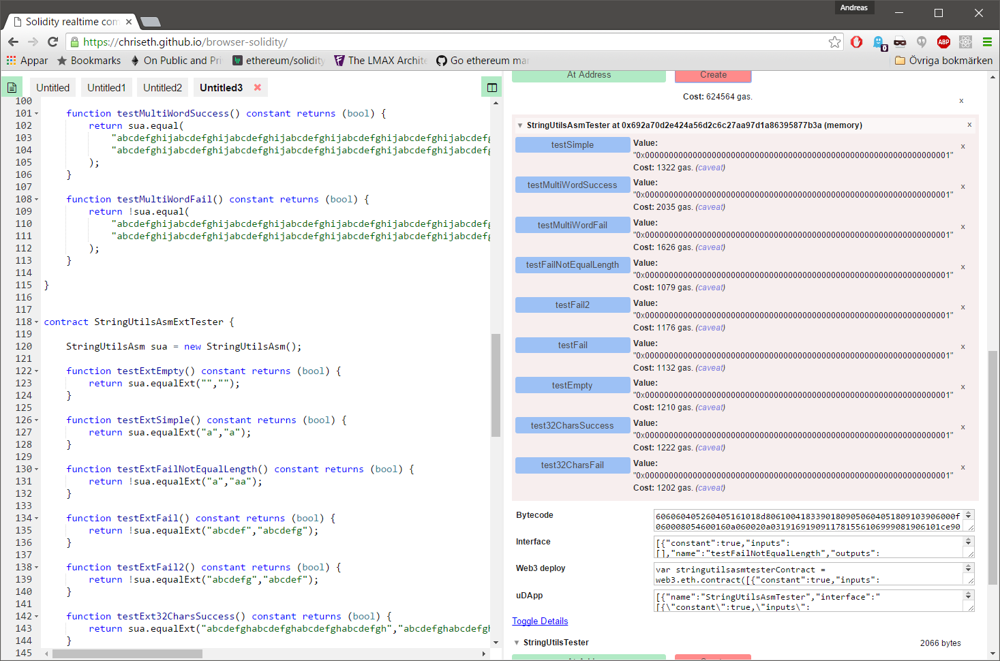
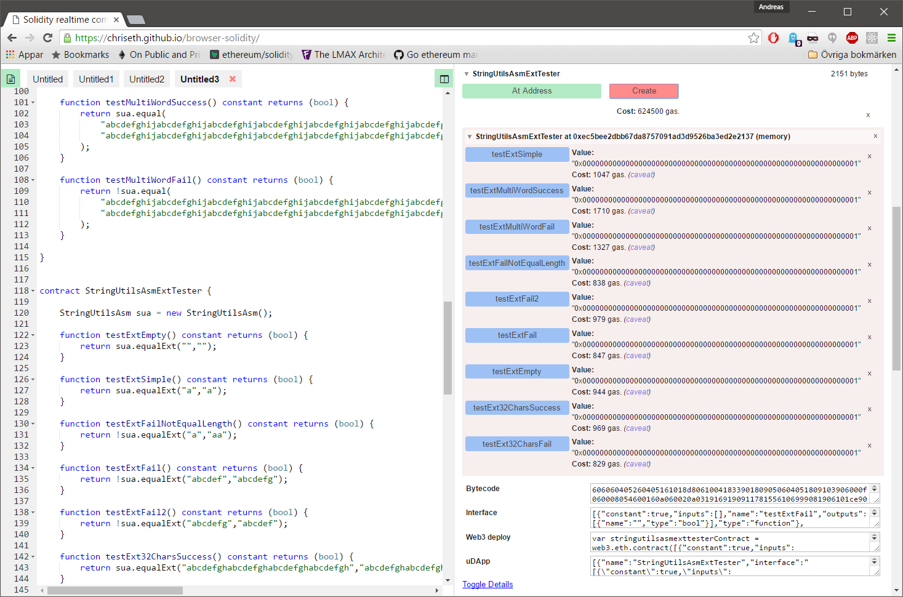
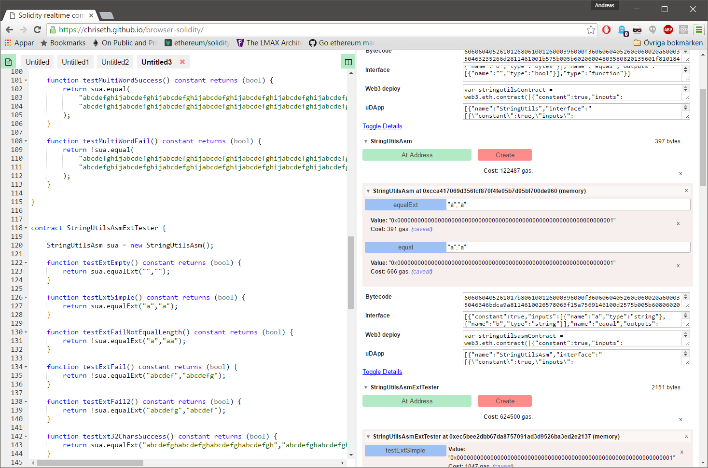

# String assembly demo

In this post I will show an example of how Solidity's new inline assembly can be used to create more efficient contracts. The example contract is very simple; it has two functions that can be called to check if two strings are equal.

There two functions here do the same thing; the only difference is that one reads the strings directly from the transaction data, and the other works with them through their solidity variables. The first alternative is less idiomatic, but slightly more efficient.

Here is the code:

```
contract StringUtilsAsm {

    // External reads strings directly from calldata (does not access strings a or b using the variables)
    function equalExt(string a, string b) constant external returns (bool) {
        assembly {
                let res := 0
                let lA := calldataload(0x44) // length of a
                let words := add(div(lA, 32), gt(mod(lA, 32), 0)) // Total number of words. Basically: ceil(lengthOfA / 32)
                let lBaddr := add(calldataload(0x24), 4) // Address in calldata where length of B is stored.
                let lB := calldataload(lBaddr)
                jumpi(tag_compare, eq(lA, lB)) // Compare byte-for-byte if length is equal, otherwise return false.
            tag_finalize:
                mstore(0x0, res)
                return(0x0, 32)
            tag_compare:
                {
                        let i := 0
                        let offsetA := 0x64 // Where in calldata the string 'a' begins.
                        let offsetB := add(lBaddr, 32) // And 'b'
                    tag_loop:
                        {
                            let offset := mul(i, 32)
                            i := add(i, 1)
                            res := eq(calldataload(add(offsetA, offset)), calldataload(add(offsetB, offset)))
                        }
                        jumpi(tag_loop, and(lt(i, words), res) ) // Continue to loop when string-segments are equal, and 'i < words'
                }
                jump(tag_finalize)
        }
    }

    // Reads strings after having been copied to memory (does not access strings a or b using the variables).
    function equal(string a, string b) constant returns (bool) {
        assembly {
                let res := 0
                let lA := mload(a)   // lA address is 0x60
                let words := add(div(lA, 32), gt(mod(lA, 32), 0)) // Total number of words. Basically: ceil(lengthOfA / 32)
                let lB := mload(b)
                jumpi(tag_compare, eq(lA, lB))
            tag_finalize:
                mstore(0x0, res)
                return(0x0, 32)
            tag_compare:
                {
                        let i := 0
                        let offsetA := add(a, 32)
                        let offsetB := add(b, 32)
                    tag_loop:
                        {
                            let offset := mul(i, 32)
                            i := add(i, 1)
                            res := eq(mload(add(offsetA, offset)), mload(add(offsetB, offset)))
                        }
                        jumpi(tag_loop, and(lt(i, words), res) )
                }
                jump(tag_finalize)
        }
    }
}
```

This is a few test contracts. It is possible to paste the above contract into browser Solidity, then paste the following two contracts and run them to see that it works, and get the gas estmates for each function.

```
contract StringUtilsAsmTester {

    StringUtilsAsm sua = new StringUtilsAsm();

    function testEmpty() constant returns (bool) {
        return sua.equal("","");
    }

    function testSimple() constant returns (bool) {
        return sua.equal("a","a");
    }

    function testFailNotEqualLength() constant returns (bool) {
        return !sua.equal("a","aa");
    }

    function testFail() constant returns (bool) {
        return !sua.equal("abcdef","abcdefg");
    }

    function testFail2() constant returns (bool) {
        return !sua.equal("abcdefg","abcdef");
    }

    function test32CharsSuccess() constant returns (bool) {
        return sua.equal("abcdefghabcdefghabcdefghabcdefgh","abcdefghabcdefghabcdefghabcdefgh");
    }

    function test32CharsFail() constant returns (bool) {
        return !sua.equal("abcdefghabcdefghabcdefgh","abcdefghabcdqfghabcdefghabcdefgh");
    }

    function testMultiWordSuccess() constant returns (bool) {
        return sua.equal(
            "abcdefghijabcdefghijabcdefghijabcdefghijabcdefghijabcdefghijabcdefghijabcdefghijabcdefghijabcdefghijabcdefghijabcdefghijabcdefghijabcdefghijabcdefghijabcdefghijabcdefghijabcdefghijabcdefghijabcdefghijabcdefghij",
            "abcdefghijabcdefghijabcdefghijabcdefghijabcdefghijabcdefghijabcdefghijabcdefghijabcdefghijabcdefghijabcdefghijabcdefghijabcdefghijabcdefghijabcdefghijabcdefghijabcdefghijabcdefghijabcdefghijabcdefghijabcdefghij"
        );
    }

    function testMultiWordFail() constant returns (bool) {
        return !sua.equal(
            "abcdefghijabcdefghijabcdefghijabcdefghijabcdefghijabcdefghijabcdefghij",
            "abcdefghijabcdefghijabcdefghijabcdefghijabcdefghijabcdefghijabcdefghir"
        );
    }

}


contract StringUtilsAsmExtTester {

    StringUtilsAsm sua = new StringUtilsAsm();

    function testExtEmpty() constant returns (bool) {
        return sua.equalExt("","");
    }

    function testExtSimple() constant returns (bool) {
        return sua.equalExt("a","a");
    }

    function testExtFailNotEqualLength() constant returns (bool) {
        return !sua.equalExt("a","aa");
    }

    function testExtFail() constant returns (bool) {
        return !sua.equalExt("abcdef","abcdefg");
    }

    function testExtFail2() constant returns (bool) {
        return !sua.equalExt("abcdefg","abcdef");
    }

    function testExt32CharsSuccess() constant returns (bool) {
        return sua.equalExt("abcdefghabcdefghabcdefghabcdefgh","abcdefghabcdefghabcdefghabcdefgh");
    }

    function testExt32CharsFail() constant returns (bool) {
        return !sua.equalExt("abcdefghabcdefghabcdefgh","abcdefghabcdqfghabcdefghabcdefgh");
    }

    function testExtMultiWordSuccess() constant returns (bool) {
        return sua.equalExt(
            "abcdefghijabcdefghijabcdefghijabcdefghijabcdefghijabcdefghijabcdefghijabcdefghijabcdefghijabcdefghijabcdefghijabcdefghijabcdefghijabcdefghijabcdefghijabcdefghijabcdefghijabcdefghijabcdefghijabcdefghijabcdefghij",
            "abcdefghijabcdefghijabcdefghijabcdefghijabcdefghijabcdefghijabcdefghijabcdefghijabcdefghijabcdefghijabcdefghijabcdefghijabcdefghijabcdefghijabcdefghijabcdefghijabcdefghijabcdefghijabcdefghijabcdefghijabcdefghij"
        );
    }

    function testExtMultiWordFail() constant returns (bool) {
        return !sua.equalExt(
            "abcdefghijabcdefghijabcdefghijabcdefghijabcdefghijabcdefghijabcdefghij",
            "abcdefghijabcdefghijabcdefghijabcdefghijabcdefghijabcdefghijabcdefghir"
        );
    }

}
```

This is what I get when optimizing the contracts and then creating them.

StringUtilsAsmTester:


StringUtilsAsmExtTester:


Note that much of the gas cost is for the call to the string utils contract (which is how it would normally be called). This is the cost when calling directly:



Now a comparison with a regular, non-assembly contract. Note that this even use bytes directly, and not strings, because if strings are used they first need to be converted to bytes because there is no support for index access yet.

```
contract StringUtils {

    /// @dev Compares two strings and returns true iff they are equal.
    function equal(bytes a, bytes b) constant returns (bool) {
        uint length = a.length;
        if (b.length != a.length) {
            return false;
        }
        for (uint i = 0; i < length; i ++) {
            if (a[i] != b[i])
                return false;
        }
        return true;
    }

}


contract StringUtilsTester {

    StringUtils sua = new StringUtils();

    function testEmpty() constant returns (bool) {
        return sua.equal("","");
    }

    function testSimple() constant returns (bool) {
        return sua.equal("a","a");
    }

    function testFailNotEqualLength() constant returns (bool) {
        return !sua.equal("a","aa");
    }

    function testFail() constant returns (bool) {
        return !sua.equal("abcdef","abcdefg");
    }

    function testFail2() constant returns (bool) {
        return !sua.equal("abcdefg","abcdef");
    }

    function test32CharsSuccess() constant returns (bool) {
        return sua.equal("abcdefghabcdefghabcdefghabcdefgh","abcdefghabcdefghabcdefghabcdefgh");
    }

    function test32CharsFail() constant returns (bool) {
        return !sua.equal("abcdefghabcdefghabcdefgh","abcdefghabcdqfghabcdefghabcdefgh");
    }

    function testMultiWordSuccess() constant returns (bool) {
        return sua.equal(
            "abcdefghijabcdefghijabcdefghijabcdefghijabcdefghijabcdefghijabcdefghijabcdefghijabcdefghijabcdefghijabcdefghijabcdefghijabcdefghijabcdefghijabcdefghijabcdefghijabcdefghijabcdefghijabcdefghijabcdefghijabcdefghij",
            "abcdefghijabcdefghijabcdefghijabcdefghijabcdefghijabcdefghijabcdefghijabcdefghijabcdefghijabcdefghijabcdefghijabcdefghijabcdefghijabcdefghijabcdefghijabcdefghijabcdefghijabcdefghijabcdefghijabcdefghijabcdefghij"
        );
    }

    function testMultiWordFail() constant returns (bool) {
        return !sua.equal(
            "abcdefghijabcdefghijabcdefghijabcdefghijabcdefghijabcdefghijabcdefghij",
            "abcdefghijabcdefghijabcdefghijabcdefghijabcdefghijabcdefghijabcdefghir"
        );
    }

}
```

Here is the results:


Notice it is slightly more expensive for small strings, but balloons as the length of the string grows. In fact this could be an error in the gas estimation, because 60k is a bit over the top.

Either way, the cost is higher, and the reason is extra instructions, and much of it is because it must check byte-for-byte rather then 32 bytes at a time. Removing one of the functions from the assembly contract will put it at about 150 bytes, while the normal Solidity contract is at about 300, and of course all those extra instructions will be used.