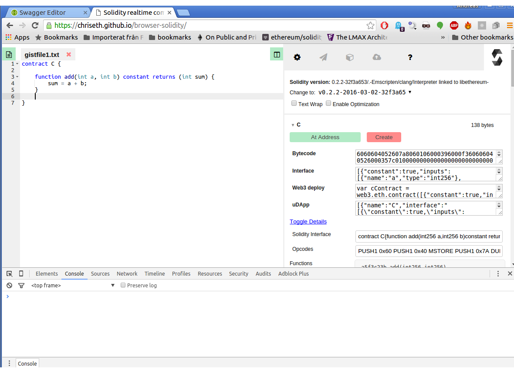

# Advanced Solidity I - Introduction

This series will be about advanced Solidity. The focus will be on what goes on behind the scenes; how memory works, how storage works, EVM assembly, and later the coming "formal Solidity".
 
This first part is an advanced introduction to Solidity contracts, and how Solidity code is being executed and run in the EVM. These things are good to know in general, and necessary for those who intend to use inline assembly in their contracts.

Readers should understand how Ethereum and Solidity works. 

A great introduction to the Ethereum protocol can be found in Ethereum founder Vitalik Buterin's white-paper.

A basic outline of how contracts and accounts works can be found in the official Ethereum [development tutorial](https://github.com/ethereum/wiki/wiki/Ethereum-Development-Tutorial). Accounts are also explained briefly in my [solidity systems tutorial](https://github.com/androlo/solidity-workshop/blob/master/tutorials/2016-02-17-solidity-systems-I.md#accounts-code-and-storage).

Note that some of the fundamentals will change with the Serenity release - especially with respect to transactions and accounts - but the vast majority of this will still apply.

### Accounts, transactions, and code-execution

Ethereum contracts are stored in special contract accounts, and the contract code is executed when the account is the target of a (successful) transaction. If I, as a user, want to execute a contract, I first need to find out the address to the account in which the contract is stored, and then transact to it. The parameters for a transaction are: 

- The gas-price I want to pay (`gasPrice`).

- The maximum amount of gas that may be spent (`gas`).

- The amount of ether I want to transfer (`value`).

- My account address (`from`).
 
- The target account address (`to`).  

- The nonce (`nonce`).

- The transaction data (`data`).

Alternatively, it is possible to create the transaction object itself on the caller side, sign it locally, and pass in the signed bytes. The parameters used above is used when making RPC calls, and the client will then create (and sign) the transaction object for you. 

Anyways, if my transaction is valid, the Ethereum client will put that transaction data into a [context](http://solidity.readthedocs.org/en/latest/units-and-global-variables.html#special-variables-and-functions), along with the current block data and some other things. It then passes the code of the contract account and the context into a new instance of the EVM, and execute it.

**Example**

Go to the [online Solidity compiler](https://chriseth.github.io/browser-solidity/), clean out anything that's there (or open a new tab), and paste this code:

```
contract C {
    
    function add(int a, int b) constant returns (int sum) {
        sum = a + b;
    }
    
}
```

*HINT: If You get different results then those posted here, change the solc version to `0.2.2-2016-03-02-32f3a653`*

After pasting in the code, you should see the contract listed to the right:



Clicking on `toggle details` will show the more advanced contract data, such as the runtime bytecode, function signatures and EVM assembly. Before looking at all the different fields in detail, we will first go over the anatomy of an Ethereum contract.

### An Ethereum contract

Ethereum contracts consist of two main parts - The init and the body part. 

##### Init

The first is the initialization part. It contains the constructor and other initialization logic (like field initialization). The init part is executed only once during the contracts lifecycle, and that is when the contract is uploaded onto the chain, i.e. when a `CREATE` instruction leads to a successful creation of a new instance of the contract.

##### Body

The second part is the `runtime` part, or `body`. This is the part of the code that is actually stored in a contract account.

##### Creating contracts

New contracts can be created in two ways, either by sending a new contract transaction to the chain from an external account, or by creating it within an already existing contract using `new`. 

Contract create transactions is done by passing the compiled bytecode (all of it) into the data field of a transaction, and leaving the receiver address empty. You may have used web3 to create contracts, and seen that in order to create a new contract you will call `new` on the contract factory object, and pass in the bytecode in the transaction object. This is why.

The mechanics behind this init/body system is straight forward. Init is just a series of VM instructions that ends with a RETURN. The value returned is actually the bytecode of the runtime portion. This can be illustrated by using the old LLL language. Here is a very basic contract written in LLL:

```
{
  [[0x0]] (caller)
  
  (return 0x0 (lll {
    (when (= (caller) @@0) (suicide (caller)))
  } 0x0))
}
```

The contract is essentially the `init` section in LLL. It uses `[[A]] B` (which is shorthand for `(SSTORE A B)`) to write the address of the caller to storage address `0x0`. It then finishes by returning the runtime portion. 

The return looks weird, but by breaking it down we can see it's on the form `(return 0x0 x)`, which means "return `x` bytes from memory, starting at position `0x0`. The expression `x = (lll y 0x0)` just means "interpret the expression `y` as LLL, compile it and write the bytes to memory, starting at address `z`. It evaluates to the total amount of bytes written. The runtime portion (`y = {(when (= (caller) @@0) (suicide (caller)))}`) is just code for "if caller is the creator, suicide the contract".
 
This is the skeleton of every LLL contract ever written, or at least the ones made after the `lll` command was added (a glorious day). Serpent also works this way, and even has a special `init` function. Solidity works this way too, of course, but hides it completely.

### The Browser Compiler

With this in mind, it is easier to explain what all the data in the browser-compiler means.

##### Bytecode

The full bytecode of the contract. It contains the init and body parts.

##### Runtime Bytecode

Contains only the runtime part. This is what is added to the actual contract account.

##### Opcodes

This is the bytecode if opcode bytes are replaced with their mnemonic. For example, the PUSH is the mnemonic for the number `0x60`. 
   
If go-ethereum (geth) is installed, you can actually disassemble bytecode using the `disasm` command. Try running it with the bytecode for the C contract and you can check that the result matches the data in the opcodes section.

```
echo "6060604052607a8060106000396000f360606040526000357c010000000000000000000000000000000000000000000000000000000090048063a5f3c23b146037576035565b005b60546004808035906020019091908035906020019091905050606a565b6040518082815260200191505060405180910390f35b6000818301905080505b9291505056" | disasm
```

##### Assembly

Assembly is a slightly different, annotated version of the data in the opcodes section.

##### Interface / Solidity interface / Functions

These are just different representations of the contract interface. Functions and will be treated later.

##### Web3 deploy / uDApp

Used to deploy contracts with Web3 and Universal DApp. 

##### Gas estimates

Used to estimate the gas cost for different functions.

### Simple contract assembly

In this section we will be looking more closely on the assembly code, and why it looks the way it does. Let's start by pasting in a simpler contract in the browser compiler:

```
contract C {}
```

This is the Assembly output:
 
```
.code
  PUSH 60			contract C {}
  PUSH 40			contract C {}
  MSTORE 			contract C {}
  PUSH #[$] 0000000000000000000000000000000000000000000000000000000000000000			contract C {}
  DUP1 			contract C {}
  PUSH [$] 0000000000000000000000000000000000000000000000000000000000000000			contract C {}
  PUSH 0			contract C {}
  CODECOPY 			contract C {}
  PUSH 0			contract C {}
  RETURN 			contract C {}
.data
  0:
    .code
      PUSH 60			contract C {}
      PUSH 40			contract C {}
      MSTORE 			contract C {}
      PUSH [tag] 1			contract C {}
      JUMP 			contract C {}
    tag 1			contract C {}
      JUMPDEST 			contract C {}
      STOP 			contract C {}
    .data
```

This is the opcodes:

`PUSH1 0x60 PUSH1 0x40 MSTORE PUSH1 0xA DUP1 PUSH1 0x10 PUSH1 0x0 CODECOPY PUSH1 0x0 RETURN PUSH1 0x60 PUSH1 0x40 MSTORE PUSH1 0x8 JUMP JUMPDEST STOP`

We will start by looking at the first part between `.code` and `.data`.

```
.code
  PUSH 60			contract C {}
  PUSH 40			contract C {}
  MSTORE 			contract C {}
  PUSH #[$] 0000000000000000000000000000000000000000000000000000000000000000			contract C {}
  DUP1 			contract C {}
  PUSH [$] 0000000000000000000000000000000000000000000000000000000000000000			contract C {}
  PUSH 0			contract C {}
  CODECOPY 			contract C {}
  PUSH 0			contract C {}
  RETURN 			contract C {}
.data
```

This ends on a return, meaning we can cut the opcodes at the first `RETURN` as well.

`PUSH1 0x60 PUSH1 0x40 MSTORE PUSH1 0xA DUP1 PUSH1 0x10 PUSH1 0x0 CODECOPY PUSH1 0x0 RETURN`

This is the `init` section of the contract. What it does first is to `PUSH` the numbers `0x60` and `0x40` onto the stack, and then run `MSTORE`. According to the [yellow paper](http://gavwood.com/paper.pdf) (page 27), there is no `PUSH` instruction; instead there are 32 different `PUSHn` instructions, for `n = 1 to 32`. Looking at the opcodes we can see that `PUSH` in this case is in fact `PUSH1`, which simply pushes the following byte onto the stack (this can also be seen by looking at the byte-size of the value that's being pushed).
 
When reaching the `MSTORE` instruction, that means we have two items on the stack: `0x60`, and (at the top) `0x40`. On page 26 of the yellow paper, it says `MSTORE` is used to store a word in memory. It takes two parameters: The first is for the offset, and the second is the word. In this case it will store the byte `0x60` at memory address `0x40`.

The state at this point would be an empty stack, and the value `0x60` stored at memory address `0x40`. The program counter would be at 5:

0: PUSH1

1: 0x60

2: PUSH1

3: 0x40

4: MSTORE

Next it starts getting weird. The next instruction is to push `0xA` onto the stack and then dup it. Then it pushes `0x10`, `0x00`, and runs `CODECOPY`. After that it pushes `0x0` and then it runs `RETURN`.

This is happening because of the afore-mentioned "init returns the body" rule. `CODECOPY` will copy the code that is currently being executed into memory. If we look up `CODECOPY` in the yellow paper, we see it has three operands. Finding out what they actually are is a bit harder (...), but it is this:
 
`CODECOPY memoryOffset codeOffset codeLength`

The first param is the memory address where we want the code array to start. The second is where in the code array we want to start copying, and the third is the number of bytes we want to copy.

The last item put on the stack is `0x0`, meaning that's the memory address where the code bytes will start. 

The goal here is to copy all the code that comes after the `RETURN` statement, because we only want the body, so basically everything from byte 16 and onward. That is of course `0x10` in hex, which is why that's the second stack item.

Length is also pretty simple. When the contract was compiled, it automatically computed the length of the body (the length of the code minus 16), just as it computed where the body starts. The length of the body here is `10` bytes, or `0xA`, which is why that's the third item on the stack. These are all popped when the `CODECOPY` instruction is carried out, leaving `0xA` as the only remaining item (remember we duped it). Memory will have 10 bytes added to it, starting at address 0.

Finally it pushes `0x0` and then returns. I already explained why in the LLL example. On page 29 of the yellow paper we can see the `RETURN` instruction. It specifies a segment of memory that will be returned as execution output. It takes two parameters, the first is the memory offset, and the second is the number of bytes. The first item on the stack was just pushed, and is `0x0`, and the second (and last) item is `0xA`.

At this point we're finally done, and the contract will have been created. But one question remains: Why did it start with that `MSTORE`? The execution is now done, and the address was never even referenced?

Actually it is used as a pointer to the next memory address that can be used for writing. If we start reading the runtime portion of the code, we see that the exact same thing is happening again. The address `0x40` is reserved, and points to the next available memory slot which initially is `0x60` (`0x40` + `0x20`, or 32, which is the EVM word-size). Note that I'm not 100% sure of how that entire process works now, so if something has changed I will correct this when I get more into memory in a coming post.

##### The body

The body part is easier to understand. This is the assembly:

```
.code
  PUSH 60			contract C {}
  PUSH 40			contract C {}
  MSTORE 			contract C {}
  PUSH [tag] 1			contract C {}
  JUMP 			contract C {}
tag 1			contract C {}
  JUMPDEST 			contract C {}
  STOP 			contract C {}
.data
```

These are the opcodes:

`PUSH1 0x60 PUSH1 0x40 MSTORE PUSH1 0x8 JUMP JUMPDEST STOP`

The first part is just the memory thing (setting up the pointer). After that, we see the value `0x8` being pushed (`tag 1`) in the assembly. Then we see a jump. `JUMP` (YP, page 26) takes the first value on the stack (which is `0x8`) and use that to set the program counter. Looking at the opcodes, we see that the opcode with index 8 is `JUMPDEST`, which is basically a way to say it is a designated jump location, and is skipped, so the next instruction to be run after the jump is `STOP`. Stop simply halts execution and returns nothing.
 
This is what an empty body looks like. It does nothing, except initializing the memory pointer. Note that the weird jump is not actually needed here. It could have just run stop. In fact, if you enable the optimizer (checkbox at the top, near the compiler version), it will detect this and the body assembly becomes:


```
.code
  PUSH 60			contract C {}
  PUSH 40			contract C {}
  MSTORE 			contract C {}
  STOP 			contract C {}
.data
```

### Functions

The previous section explained how the init code looks, and what instructions are added to the code regardless of the contract type. Next we will look at a contract with one simple function in it. It explains how functions are called, which is the second step in understanding how Solidity works.

The contract we're going to use now is this:

```
contract C {
    
    function f() {
        
    }
    
}
```

Paste it into the browser compiler, and make sure that `Enable Optimization' is checked. It should have the following assembly:

```
.code
  PUSH 60			contract C {\n    
    functio...
  PUSH 40			contract C {\n    
    functio...
  MSTORE 			contract C {\n    
    functio...
  PUSH #[$] 0000000000000000000000000000000000000000000000000000000000000000			contract C {\n    
    functio...
  DUP1 			contract C {\n    
    functio...
  PUSH [$] 0000000000000000000000000000000000000000000000000000000000000000			contract C {\n    
    functio...
  PUSH 0			contract C {\n    
    functio...
  CODECOPY 			contract C {\n    
    functio...
  PUSH 0			contract C {\n    
    functio...
  RETURN 			contract C {\n    
    functio...
.data
  0:
    .code
      PUSH 60			contract C {\n    
    functio...
      PUSH 40			contract C {\n    
    functio...
      MSTORE 			contract C {\n    
    functio...
      PUSH E0			
      PUSH 2			
      EXP 			
      PUSH 0			contract C {\n    
    functio...
      CALLDATALOAD 			contract C {\n    
    functio...
      DIV 			contract C {\n    
    functio...
      PUSH 26121FF0			contract C {\n    
    functio...
      DUP2 			contract C {\n    
    functio...
      EQ 			contract C {\n    
    functio...
      PUSH [tag] 2			contract C {\n    
    functio...
      JUMPI 			contract C {\n    
    functio...
    tag 1			contract C {\n    
    functio...
      JUMPDEST 			contract C {\n    
    functio...
      STOP 			contract C {\n    
    functio...
    tag 2			function f() {\n        
    }
      JUMPDEST 			function f() {\n        
    }
      PUSH [tag] 1			function f() {\n        
    }
      JUMP [out]			function f() {\n        
    }
    .data
```

These are the opcodes:

`PUSH1 0x60 PUSH1 0x40 MSTORE PUSH1 0x1E DUP1 PUSH1 0x10 PUSH1 0x0 CODECOPY PUSH1 0x0 RETURN PUSH1 0x60 PUSH1 0x40 MSTORE PUSH1 0xE0 PUSH1 0x2 EXP PUSH1 0x0 CALLDATALOAD DIV PUSH4 0x26121FF0 DUP2 EQ PUSH1 0x1A JUMPI JUMPDEST STOP JUMPDEST PUSH1 0x18 JUMP `

We can see right away that the init section has the same format as it does in the empty contract. It uses a different value for the body code length (`0x1E`), but other then that it's the same.

The body is different though, and there are some new instructions there. Here's the body assembly:

```
.code
      PUSH 60			contract C {\n    
    functio...
      PUSH 40			contract C {\n    
    functio...
      MSTORE 			contract C {\n    
    functio...
      PUSH E0			
      PUSH 2			
      EXP 			
      PUSH 0			contract C {\n    
    functio...
      CALLDATALOAD 			contract C {\n    
    functio...
      DIV 			contract C {\n    
    functio...
      PUSH 26121FF0			contract C {\n    
    functio...
      DUP2 			contract C {\n    
    functio...
      EQ 			contract C {\n    
    functio...
      PUSH [tag] 2			contract C {\n    
    functio...
      JUMPI 			contract C {\n    
    functio...
    tag 1			contract C {\n    
    functio...
      JUMPDEST 			contract C {\n    
    functio...
      STOP 			contract C {\n    
    functio...
    tag 2			function f() {\n        
    }
      JUMPDEST 			function f() {\n        
    }
      PUSH [tag] 1			function f() {\n        
    }
      JUMP [out]			function f() {\n        
    }
    .data
```

Here are the opcodes:

`PUSH1 0x60 PUSH1 0x40 MSTORE PUSH1 0xE0 PUSH1 0x2 EXP PUSH1 0x0 CALLDATALOAD DIV PUSH4 0x26121FF0 DUP2 EQ PUSH1 0x1A JUMPI JUMPDEST STOP JUMPDEST PUSH1 0x18 JUMP `

The bit up to the first `MSTORE` is clear. It's just the memory pointer thing. It then pushes `0xE0` and `0x2` onto the stack and runs `EXP`, resulting in `2^225`, which will be explained later.

Next it pushes `0x0` onto the (empty) stack and runs `CALLDATALOAD`. On page 24 of the yellow-paper we see that it takes 1 parameter, which is an offset. `CALLDATALOAD` is just a reference to the transaction data, i.e. the data that was passed along with the transaction. In this case it wants the data stored at calldata address 0. `CALLDATALOAD` always returns a full word, so it will clear `0x0` from the stack and replace it with the first 32 bytes of the calldata. If calldata is empty, or less then 32 bytes, the return value will still be padded with zeroes to become 32 bytes.

Next it divides the value from `CALLDATALOAD 0` with the enormous number, pushes the number `0x256121FF0` onto the stack, dupes the result of the division and does an equals check against the new number. The division between the calldata and the enormous number is just to shave everything but the first four bytes off, so that it can be compared with `0x256121FF0`. The reason it does this becomes clearer when looking at the `Functions` section of the browser compiler, and the [Ethereum Contract ABI](https://github.com/ethereum/wiki/wiki/Ethereum-Contract-ABI#function-selector).

*The first four bytes of the call data for a function call specifies the function to be called. It is the first (left, high-order in big-endian) four bytes of the Keccak (SHA-3) hash of the signature of the function.*

In the `Functions` section of the browser compiler we see this: `26121ff0 f()`, meaning this is all just a check if whether the caller wants to invoke `f`. If more functions are used, it will work the same way:

1. Get the first 32 bytes of calldata.

2. Shave everything but the first four bytes off.

3. Compare with the identifier of function 1. If no match, continue to the next function. Repeat for all functions.

4. If the signature matches no known function, either `STOP` or run the fallback function if there is one.

So what actually happens if it's a match? In this case it will push `0x1A` (tag 2) onto the stack, and do a conditional jump, `JUMPI`. On page 26 of the yellow-paper we see that the conditional jump has two params:

`JUMPI newPcVal cond`

It will change the program counter to `newPcVal` if the second param is not 0. In this case, if the function identifier in calldata equals the identifier of `f`, the program counter will be set to `0x1A`. That is a `JUMPDEST`, and the entry point to `f`. If it does not match, it will just move on, which means passing the next `JUMPDEST` (tag 1) and then `STOP`. 

Finally, notice that the execution of `f` only involves pushing `0x18` (tag 1) to the stack and then `JUMP`, meaning it's essentially just a quick detour to the same `STOP`.

### Coming posts

In the coming posts I will go into more details about the Ethereum ABI, types, calldata, memory and storage. This is necessary to know in order to write assembly code.
  
Happy Smart-contracting! 